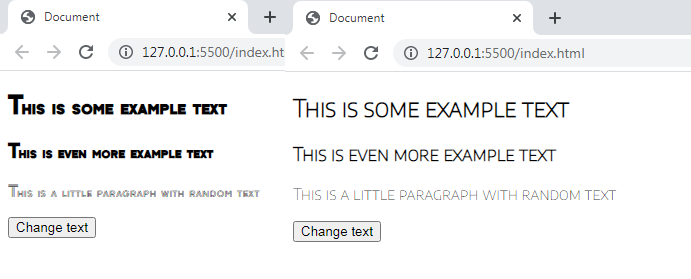

# Font changer
___

Click the button to change the font. The Javascript injects a class into the `<body>` element that contains a new font. This font overides the initial one found in the body.
___
